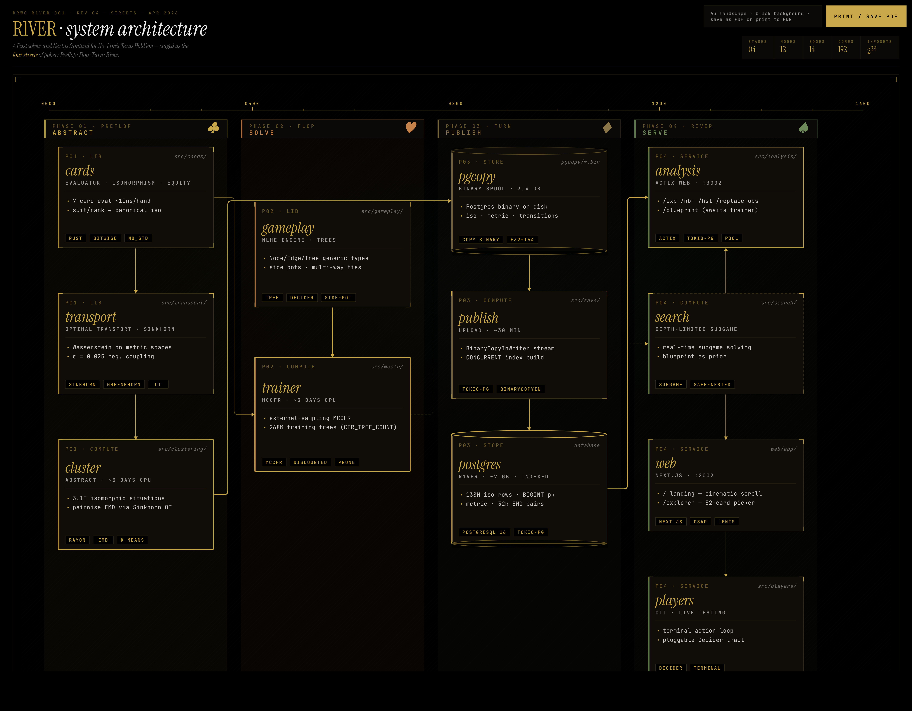

# R1VER | Poker Intelligence

A Rust solver and Next.js frontend for No-Limit Texas Hold'em, seeking functional parity with Pluribus — the first superhuman agent in multiplayer poker.

## What It Does

R1VER trains a game-theoretic poker solver from scratch: exhaustive hand abstraction, hierarchical clustering, Earth Mover's Distance metrics, and Monte Carlo Counterfactual Regret Minimization. The result is a blueprint strategy that can be queried in real time through an API and interactive frontend.

<table align="center">
<tr>
<td align="center">
    
    <br>
    <em>Monte Carlo Tree Search</em>
</td>
<td align="center">
    
    <br>
    <em>Equity Distributions</em>
</td>
</tr>
</table>

## Quick Start

```bash
# Solver (Rust)
cargo build
cargo run

# Frontend (Next.js)
cd web
npm install
npm run dev          # localhost:2002
```

The frontend expects the Rust API at `localhost:3002` (configurable via `NEXT_PUBLIC_API_URL`).

## Architecture



> The four streets of R1VER: **Abstract** → **Solve** → **Publish** → **Serve**.
> Full interactive doc at [`docs/architecture/index.html`](docs/architecture/index.html).

## Tech Stack

| Layer       | Tools                                              |
|-------------|----------------------------------------------------|
| Solver      | Rust, Rayon, Petgraph, Tokio                       |
| API         | Actix Web, PostgreSQL, tokio-postgres               |
| Frontend    | Next.js 16, React 19, Tailwind 4, GSAP             |
| CI          | GitHub Actions (build, test, bench)                 |

## Project Structure

```
R1VER/
├── src/
│   ├── cards/          # Hand evaluation, equity, isomorphisms, iterators
│   ├── clustering/     # K-means, EMD, Sinkhorn, histogram abstraction
│   ├── gameplay/       # Game engine, actions, settlements, showdowns
│   ├── mccfr/          # Monte Carlo CFR solver, blueprint convergence
│   ├── transport/      # Optimal transport, Wasserstein distance
│   ├── analysis/       # API server, CLI, SQL queries
│   ├── players/        # Human player interface
│   ├── save/           # Disk persistence, Postgres binary format
│   └── search/         # Real-time subgame solving (in progress)
├── web/
│   └── app/
│       ├── components/ # Landing page sections, card picker, charts
│       ├── lib/        # API client, card utilities
│       ├── explorer/   # Hand explorer — equity, clusters, neighbors
│       └── strategy/   # Strategy viewer — blueprint query interface
├── benches/            # Criterion benchmarks
├── pgcopy/             # Pre-computed Postgres binary data files
└── Cargo.toml
```

## Training Pipeline

1. **Abstraction** — Exhaustively iterate 3.1T isomorphic situations per street, project equity distributions, cluster with hierarchical k-means
2. **Metrics** — Compute Earth Mover's Distance between all cluster pairs via Sinkhorn optimal transport
3. **Solve** — External sampling MCCFR with linear strategy weighting and regret-based pruning
4. **Search** — Depth-limited subgame solving with the blueprint as prior (in progress)

### Data Sizes

| Street  | Abstraction | Metric |
|---------|-------------|--------|
| Preflop | 4 KB        | 301 KB |
| Flop    | 32 MB       | 175 KB |
| Turn    | 347 MB      | 175 KB |
| River   | 3.02 GB     | —      |

## Modules

**cards** — Nanosecond hand evaluation via lazy bitwise operations. Fastest open-source evaluator, outperforming Cactus Kev. Supports exact equity enumeration, Monte Carlo simulation, full isomorphism iteration, short deck variant, and bijective u8/u16/u32/u64 representations.

**clustering** — Plays out every possible situation respecting suit/rank symmetries. Hierarchical k-means over distribution space with Earth Mover's Distance. Sinkhorn-regularized optimal transport for efficient distance computation.

**gameplay** — Complete NLHE game engine with side pots, all-ins, multi-way ties, and configurable payout structures. Clean Node/Edge/Tree representation with a generic Decider trait for pluggable player strategies.

**mccfr** — External sampling MCCFR with dynamic tree construction, linear strategy weighting, and discount schemes. Validated on Rock-Paper-Scissors before scaling to full NLHE.

**transport** — Wasserstein distance computation via greedy coupling and Greenkhorn/Sinkhorn algorithms. Supports arbitrary distributions over joint metric spaces.

**analysis** — Actix Web API server backed by PostgreSQL. Uploads Postgres binary files with indexing for fast lookups across abstractions, metrics, and blueprint strategies.

## References

1. Superhuman AI for multiplayer poker (2019) — [Science](https://science.sciencemag.org/content/early/2019/07/10/science.aay2400)
2. Potential-Aware Imperfect-Recall Abstraction with EMD (2014) — [AAAI](http://www.cs.cmu.edu/~sandholm/potential-aware_imperfect-recall.aaai14.pdf)
3. Regret Minimization in Games with Incomplete Information (2007) — [NIPS](https://papers.nips.cc/paper/3306-regret-minimization-in-games-with-incomplete-information)
4. A Fast and Optimal Hand Isomorphism Algorithm (2013) — [AAAI](https://www.cs.cmu.edu/~waugh/publications/isomorphism13.pdf)
5. Near-linear Time Approximation for Optimal Transport via Sinkhorn (2018) — [NIPS](https://arxiv.org/abs/1705.09634)
6. Solving Imperfect-Information Games via Discounted Regret Minimization (2019) — [AAAI](https://arxiv.org/pdf/1809.04040.pdf)
7. Action Translation in Extensive-Form Games (2013) — [IJCAI](http://www.cs.cmu.edu/~sandholm/reverse%20mapping.ijcai13.pdf)
8. Discretization of Continuous Action Spaces (2015) — [AAMAS](http://www.cs.cmu.edu/~sandholm/discretization.aamas15.fromACM.pdf)
9. Regret-Based Pruning in Extensive-Form Games (2015) — [NIPS](http://www.cs.cmu.edu/~sandholm/regret-basedPruning.nips15.withAppendix.pdf)
10. Depth-Limited Solving for Imperfect-Information Games (2018) — [NeurIPS](https://arxiv.org/pdf/1805.08195.pdf)
11. Reduced Space and Faster Convergence via Pruning (2017) — [ICML](http://www.cs.cmu.edu/~sandholm/reducedSpace.icml17.pdf)
12. Safe and Nested Subgame Solving (2017) — [NIPS](https://www.cs.cmu.edu/~noamb/papers/17-NIPS-Safe.pdf)

---

Built by Thomas Ou
